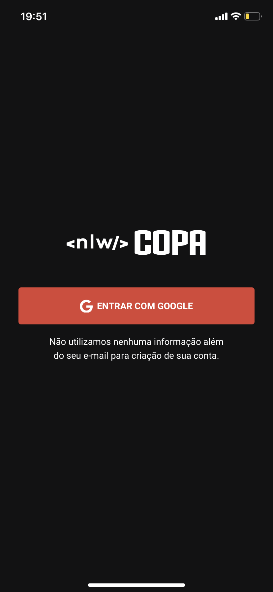
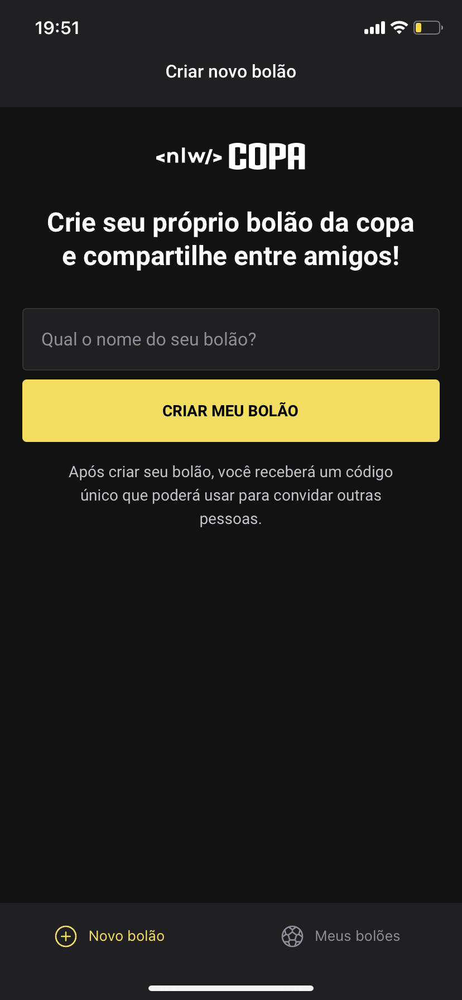
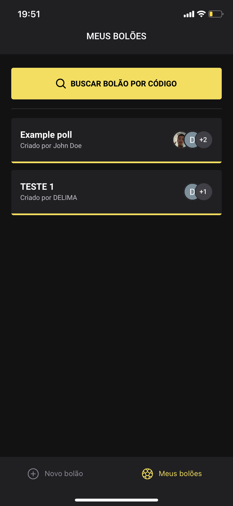
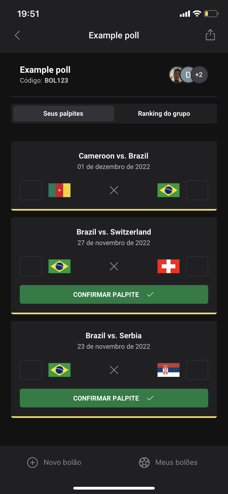
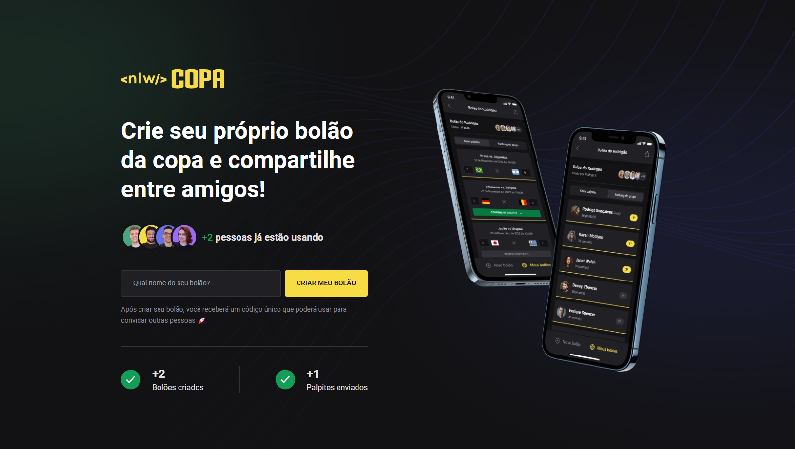

## 🛡️| NLW Copa

  <h3>Aplicação mboile</h3>
  
  
  
  
  

  <h3>Aplicação web</h3>

  

> Trilha Ignite, [🔗 Clique aqui para acessar o figma](https://www.figma.com/file/kPbyNtE4sgOP3Q3FdmCQ3r/Bol%C3%A3o-da-Copa-(Community)?node-id=0%3A1)

## 🚀| Instalação e execução
##### Clonar repositório
	git clone git@github.com:delimaqz/nlw-copa.git
  
##### Mobile
	npm install  
  
	npx expo start --clear 

##### Server
	npm install 
  
	npm run dev 
  
  

##### Web
	npm install 
  
	npm run dev
	

## 👨‍💻| TECNOLOGIAS UTILIZADAS

###  **📱| Mobile**

  - ReactNative
  - Expo
  
###  **⌨️| Back-end**

  - NodeJS
  - Prisma
  - Axios
  - OAuth2
  
###  **💻| Fron-end**

  - React
  - NextJs
  - TypeScript
  - TailwindCSS
  
 ## 🎲| CORRELAÇÃO ENTRE AS TABELAS DO BANCO DE DADOS
	

## 📲 | CONTATO

 
  
  
  

